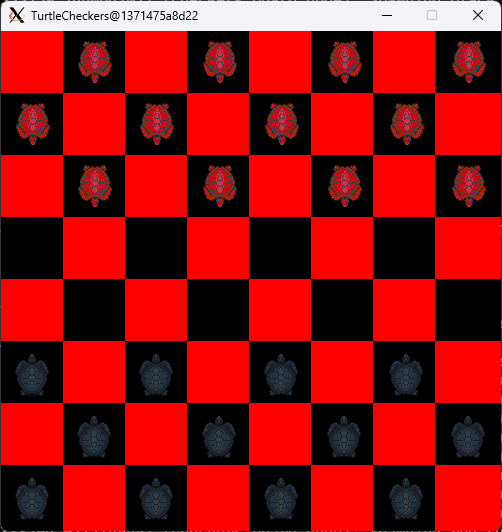

# ROSTurtleCheckers
A ROS2 GUI checkers game for two players



Requires the interfaces here: https://github.com/Shadow0144/ROSTurtleCheckersInterfaces

Requires ROS2 foxy:

<pre lang="markdown">```sudo apt install ros-foxy-desktop```</pre>

You may also need python3:

<pre lang="markdown">```sudo apt install python3-pip```</pre>

If you want to configure an email to send reports when a player is reported, you'll need mailutils:

<pre lang="markdown">```sudo apt install mailutils```</pre>

and to put your email into the report_email.config file before building and installing the project.

If you want to be able to (un)ban players, you need to put a numerical key into the turtle_checkers_authorization_key.key file. You can then ban players with:

<pre lang="markdown">```ros2 topic pub /SetPlayerBanned turtle_checkers_interfaces/msg/SetPlayerBanned "{player_name: <player name>, banned: <true/false>, authorization_key: <key>}" --once```</pre>